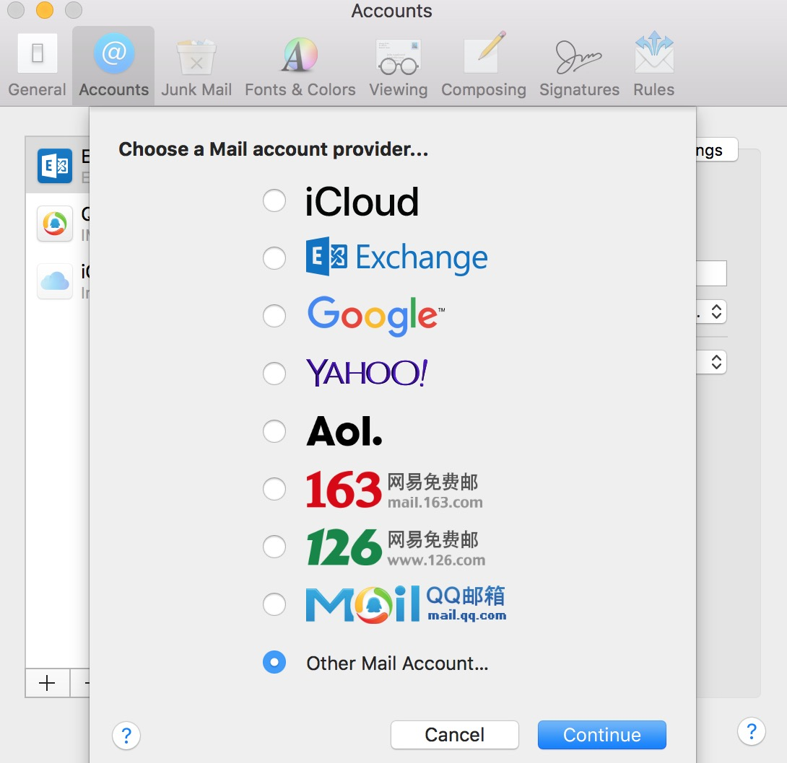
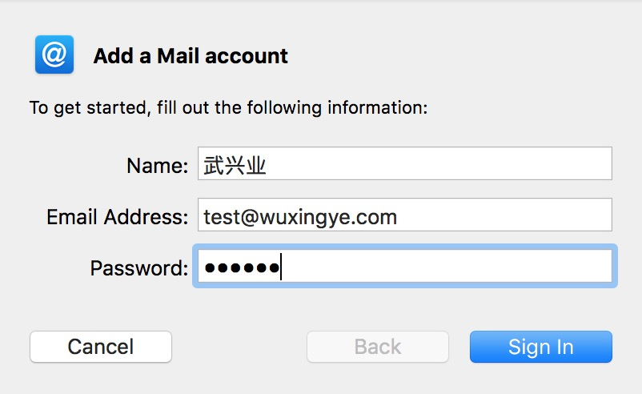
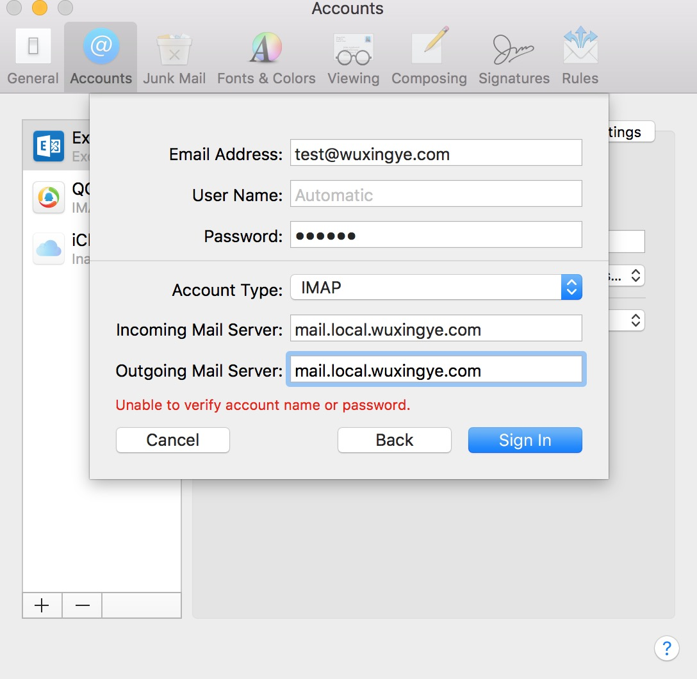
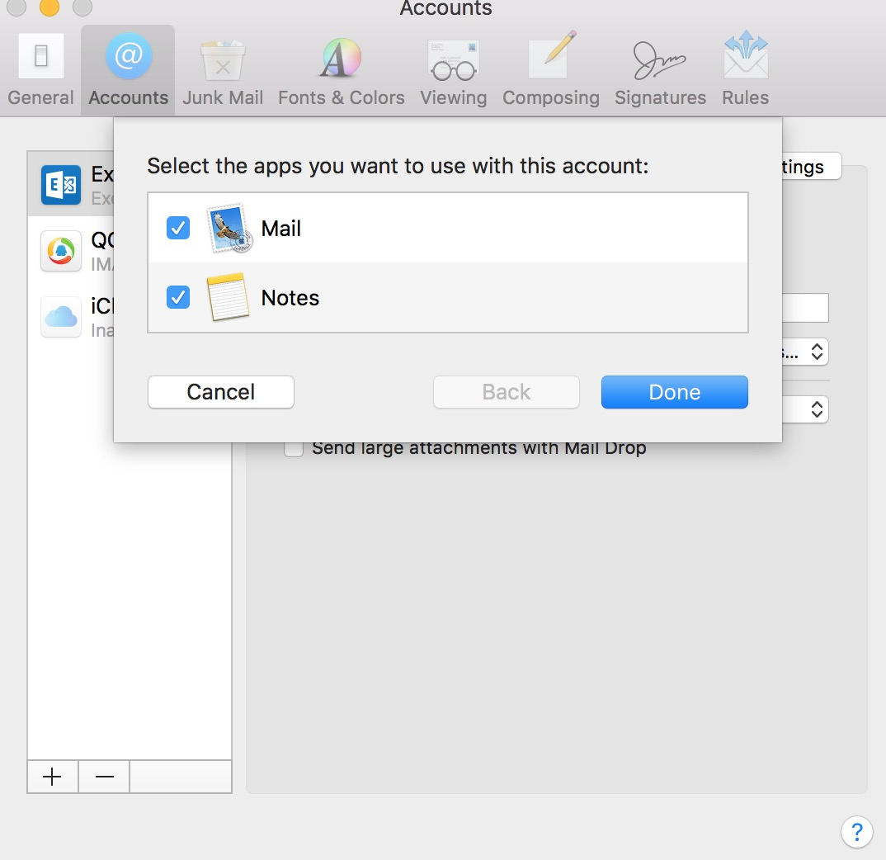

# docker-mailserver 

[github地址](https://github.com/wuxingye/docker-mailserver)

参考https://github.com/tomav/docker-mailserver 生成

### WIKI：
https://github.com/tomav/docker-mailserver/wiki

### setup.sh命令：
https://github.com/tomav/docker-mailserver/wiki/Setup-docker-mailserver-using-the-script-setup.sh

### 启动步骤：

- host添加
    ````
    127.0.0.1	mail.local.wuxingye.com
    ````
- 执行docker compose命令，启动邮件服务：
    ````
    docker-compose up -d mail
    ````
- 账户修改：
    1. ./setup.sh email add <email> <password>
       ````
       添加邮件，比如 ./setup.sh email add test@wuxingye.com 123456
       ````
    2. ./setup.sh email update <email> <password>
       ````
       更新邮件，比如 ./setup.sh email update test@wuxingye.com 123456
       ````
    3. ./setup.sh email del <email>
       ````
       删除邮件，比如 ./setup.sh email del test@wuxingye.com 123456
       ````
    4. ./setup.sh email restrict <add|del|list> <send|receive> [<email>]
       ````
       收发邮件黑名单
       ````
    5. ./setup.sh email list
       ````
       邮件列表
       ````
- mac email添加账户

   1.添加账户，选择other mail account，输入账号：test@wuxingye.com
    
    
   2.输入密码：123456
    
    
   3.输入服务器地址：mail.local.wuxingye.com
    
    
   4.完成：可以使用了
    
