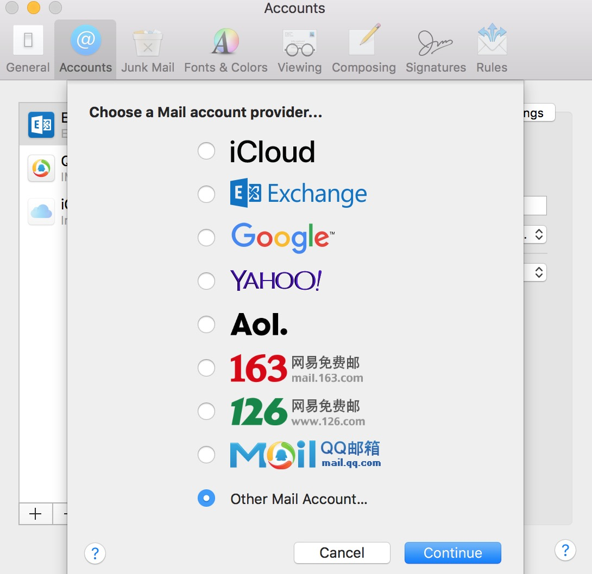
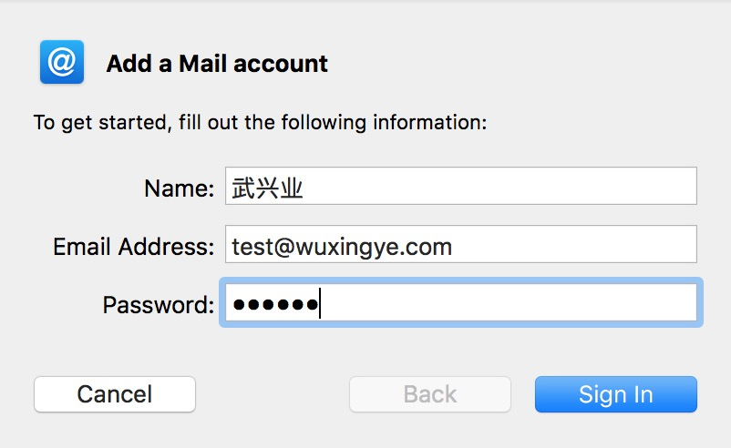
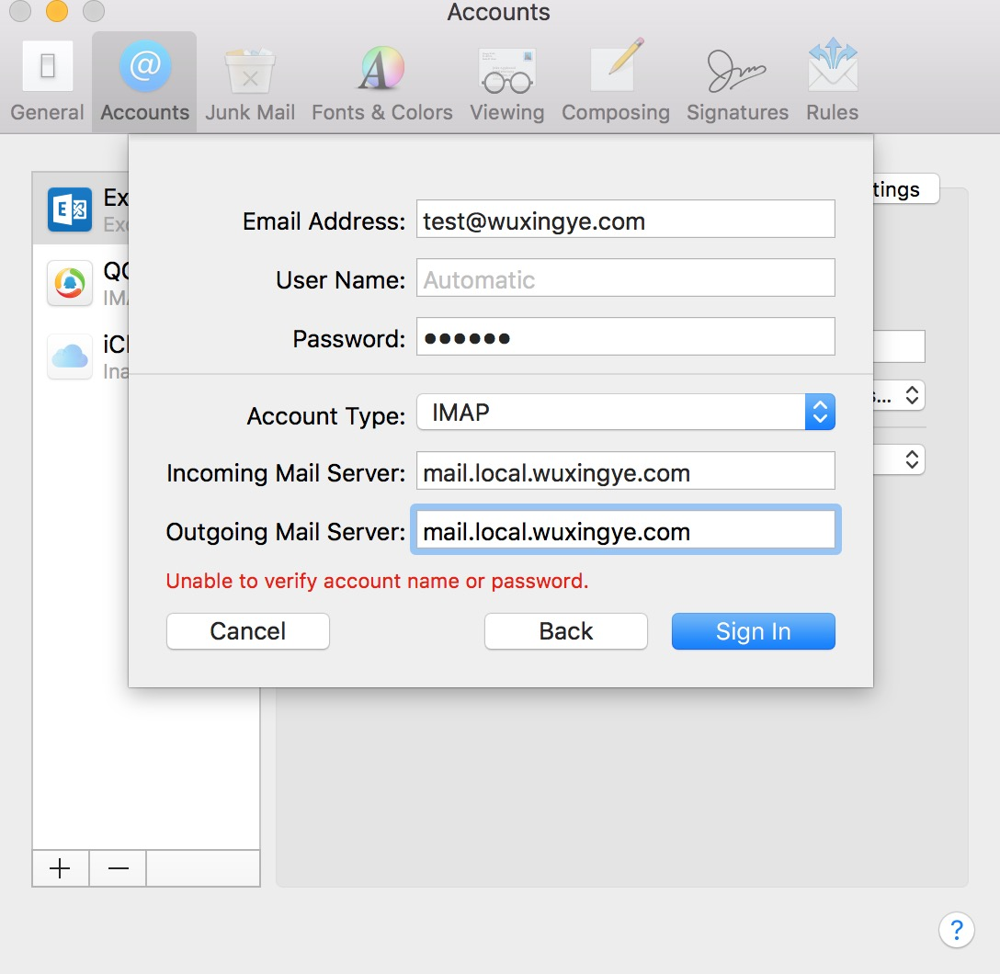
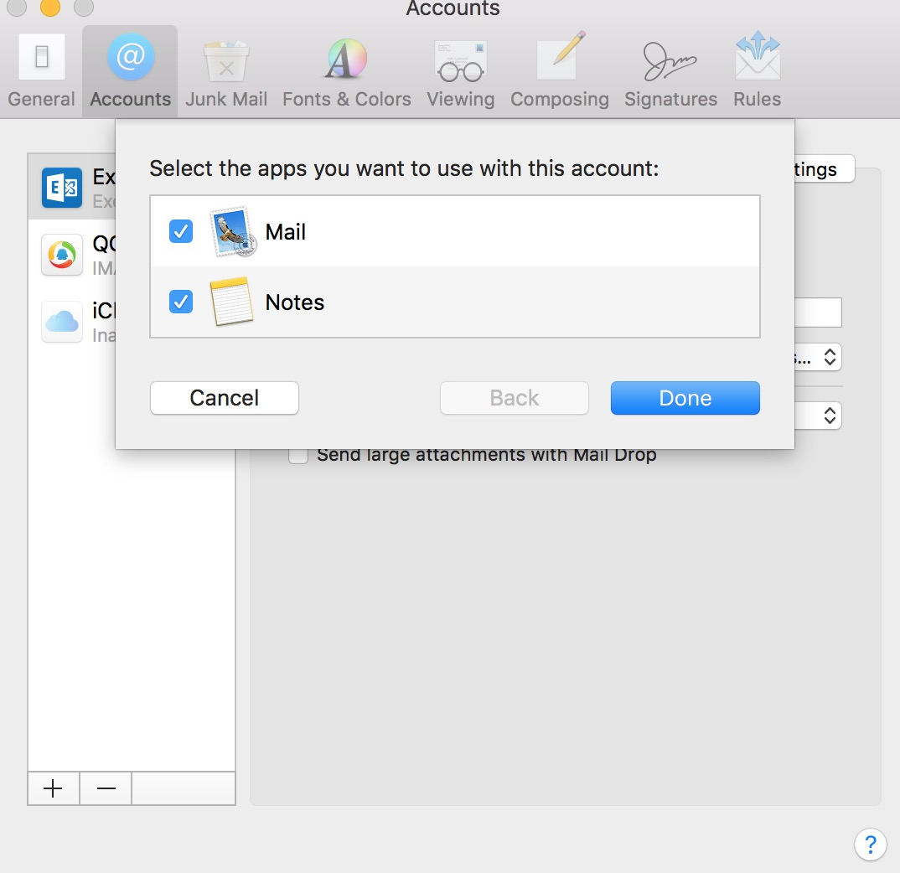

# docker-mailserver
参考https://github.com/tomav/docker-mailserver 生成

### WIKI：
https://github.com/tomav/docker-mailserver/wiki

### setup.sh命令：
https://github.com/tomav/docker-mailserver/wiki/Setup-docker-mailserver-using-the-script-setup.sh

### 启动步骤：

- host添加
    ```
    127.0.0.1	mail.local.wuxingye.com
    ```
- 执行docker compose命令，启动邮件服务：
    ```
    docker-compose up -d mail
    ```
- mac email添加账户

   1.添加账户，选择other mail account，输入账号：test@wuxingye.com
    
    
   2.输入密码：123456
    
    
   3.输入服务器地址：mail.local.wuxingye.com
    
    
   4.完成：可以使用了
    
